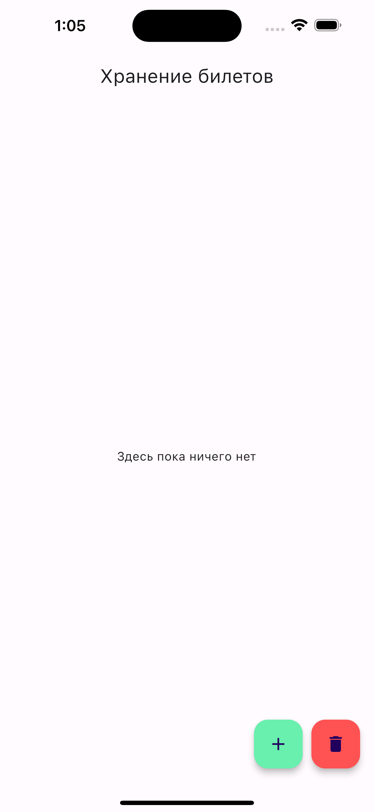

# Целевая платформа

iOS

# Результаты

- интерфейс экрана: список билетов, боттомшит для добавления билета;
- валидация данных для ввода ссылки на PDF файл;
- снекбар при успешном добавлении ссылки;
- сохранение списка файла в локальной БД (drift);
- загрузка списка билетов из БД;
- добавление билета в БД;
- удаление билета по url;
- удаление всех билетов;
- сохранение файла на устройстве (dio);
- прогресс сохранения файла.
- bloc + freezed для управления состоянием.

# Скриншоты

1. Экран хранения билетов

2. Боттомшит для добавления билета

3. Ссылка на PDF

4. Добавленый файл в списке (ожидает загрузки)

5. Файлы загружаются

6. Файлы успешно загружены 

